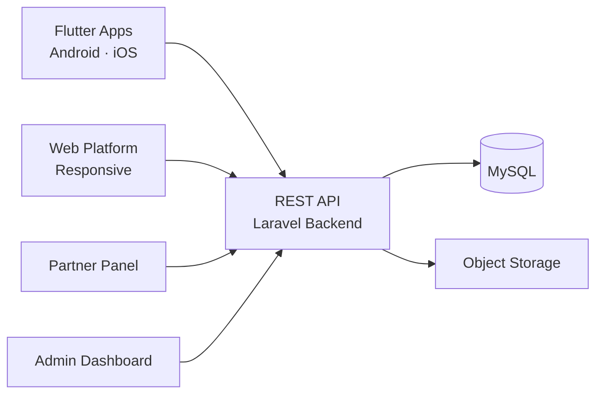

# Deepseek Clone — White-Label Solution by Miracuves

---

## Table of Contents

1. [Who Is This For?](#who-is-this-for)
2. [How It Works](#how-it-works)
3. [Core Features](#core-features)
4. [Architecture](#architecture)
5. [Revenue Streams](#revenue-streams)
6. [What's Included](#whats-included)
7. [Deployment Timeline](#deployment-timeline)
8. [Why Not Build From Scratch?](#why-not-build-from-scratch)
9. [Market Opportunity](#market-opportunity)
10. [Client Testimonials](#client-testimonials)
11. [FAQ](#faq)
12. [Resources](#resources)
13. [About Miracuves](#about-miracuves)

## Live Demos

| Environment | URL | What you can test |
|---|---|---|
| Web Platform | [mxai.mimeld.com](https://mxai.mimeld.com) | Full experience in the browser |
| Admin Dashboard | [Solution page → Demo](https://miracuves.com/deepseek-clone/#demo) | Users, content, plans, analytics |

Demo credentials: [miracuves.com/deepseek-clone -> Demo section](https://miracuves.com/deepseek-clone/#demo)

## What Makes This Deepseek Clone Different

<!-- TODO: fill 3-5 vertical-specific differentiators -->

## Who Is This For?

| Buyer Type | Use Case |
|---|---|
| SaaS Founders | Launch a coding AI platform with subscription billing |
| Developer Tools Companies | Build a white-label AI coding assistant |
| Enterprises | Internal AI coding assistant for development teams |
| Agencies | Resell coding AI capabilities to clients |

---

## How It Works

1. User signs up and selects a subscription plan
2. User accesses the coding AI interface with code editor
3. User describes the task in natural language or selects a template
4. AI generates code with explanations and suggested improvements
5. User can iterate with follow-up prompts for refinement
6. Usage is tracked against subscription tier limits

---

## Core Features

### User App
- Chat interface
- File upload
- Voice input
- Conversation history
- Custom instructions
- API access

### Admin Panel
- Model management
- Usage analytics
- Billing config
- User management
- Rate limiting

---

## Advanced Features

The platform integrates AI-powered features that reduce manual overhead and capture revenue opportunities:

- **Code Generation Engine** - Generates production-ready code from natural language descriptions
- **Logic Reasoning System** - Handles complex algorithmic and logical problem solving
- **Code Explanation AI** - Provides detailed line-by-line explanations of generated code
- **Multi-Language Support** - Supports Python, JavaScript, TypeScript, Java, Go, Rust, and more
- **Multi-Model AI** - Supports multiple LLM providers
- **Context Engine** - Long-term memory & context
- **AI Tool Integration** - Function calling capabilities

---

## Apps and Web Panels

| Module | Description |
|---|---|
| Web Application | Code editor, chat, history, settings |
| API Layer | REST API for third-party integration |
| Admin Web Panel | Users, plans, models, analytics |

---

## Architecture

**Stack:**

| Layer | Technology |
|---|---|
| Web Platform | React.js with code editor integration |
| Backend API | Node.js + Express |
| Database | MongoDB |
| AI Layer | Code-specialized LLM integration |
| Real-time | Server-Sent Events for streaming code output |
| Payments | Stripe, Razorpay |
| Cloud Hosting | AWS / DigitalOcean / Contabo VPS |

---

## Revenue Streams

The platform is engineered to generate revenue from day one through multiple complementary channels:

- **Subscription tiers** - monthly/annual plans with usage limits
- **Pay-as-you-go credits** - token-based billing for heavy API usage
- **Enterprise licenses** - custom contracts for teams
- **API access** - developer API access with usage-based pricing
- Usage-based pricing
- Subscription tiers
- API access fees
- Enterprise custom models
- White-label licensing

---

## Security and Compliance

- OTP-based authentication
- SSL/TLS encrypted API communication
- GDPR-ready data handling

---

## What's Included

| Plan | Price | What You Get |
|---|---|---|
| Standard | **$3,299** | Complete source code, all apps, admin panel, rebranding, 1 year updates |
| Enterprise | Custom Quote | Everything in Standard + custom features, multi-region, priority support |

**What is included:**

- Web Application
- API Layer
- Admin Web Panel
- Full Source Code
- Complete Rebranding (your logo, colors, app name)
- Server Deployment
- App Store and Google Play Submission Support
- 60 Days Free Bug Support
- Free 1-Year Updates

---
**Pricing:** from **$3,299** — transparent on the [solution page](https://miracuves.com/deepseek-clone/#pricing).

## Deployment Timeline

| Day | Milestone |
|---|---|
| Day 1 | Server setup, environment configuration, initial deployment |
| Day 2 | White-labeling - app name, logo, colors, splash screens |
| Day 3 | Payment gateway integration + third-party API configuration |
| Day 4 | Custom feature implementation (if applicable) |
| Day 5 | QA, testing, bug fixes across all panels |
| Day 6 | App Store + Google Play submission + Go-live |

> **Average go-live: 6 business days from payment confirmation.**

---

## Why Not Build From Scratch?

| Factor | Build from Scratch | Miracuves Solution |
|---|---|---|
| Time to Launch | 6-12 months | 6 days |
| Development Cost | $60,000-$150,000 | From $3,299 |
| Source Code Ownership | Yes | Yes |
| Customization | Full | Full |
| Post-Launch Support | Depends on team | 60 days included |
| Risk | High | Low |

---

## Market Opportunity

| Metric | Data |
|---|---|
| Global AI Coding Assistant Market (2024) | $800 million |
| Projected Market Size (2030) | $2.5 billion |
| CAGR | ~22% |
| Key Growth Markets | USA, India, China, UK, Germany |
| Developers Using AI Coding Tools (2024) | 60%+ |

> Source: Statista, Grand View Research, Allied Market Research

---

## Successful Verticals

- AI coding assistants (like DeepSeek, Copilot)
- Developer productivity tools
- Code review and quality analysis platforms
- Technical education and learning platforms
- Customer support AI
- Content generation
- Code assistant
- Education & tutoring
- Healthcare AI

---

## Client Testimonials

> *"The code generation quality is impressive. We have developers using it daily for production code."*
> - CTO, SaaS Platform

> *"Exceptional results from day one."*
> - Verified Client

> *"Scaled 3x faster than expected."*
> - Startup Founder

---

## FAQ

**How much does a DeepSeek clone cost?**
A white-label DeepSeek clone from Miracuves starts at $3,299 with complete source code ownership.

**What languages are supported?**
20+ programming languages including Python, JavaScript, TypeScript, Java, Go, Rust, and more.

**Can I use my own AI model?**
Yes. The platform supports custom model API keys.

**Is subscription billing included?**
Yes. Stripe and Razorpay subscription billing with tiered plans.

**Do I get the source code?**
Yes. Complete source code ownership is included.

**How long does it take to launch?**
6 business days from payment confirmation.

---

## Related Solutions

Explore our other white-label clone solutions:

- [ChatGPT Clone - AI Chatbot](https://github.com/Miracuves-Solutions/ChatGPT-Clone)
- [Apple AI Clone - AI Assistant](https://github.com/Miracuves-Solutions/AppleAIClone)
- [Jasper Clone - AI Content](https://github.com/Miracuves-Solutions/Jasper-Clone)

---

## Resources

- [Full Solution Page](https://miracuves.com/deepseek-clone/) — features, pricing, demos, FAQ

## Get Started

**Ready to launch your AI coding platform?**

| Channel | Link |
|---|---|
| Full Solution Page | [miracuves.com/deepseek-clone](https://miracuves.com/deepseek-clone/) |
| Email | info@miracuves.com |
| WhatsApp | [+91 98300 09649](https://wa.me/919830009649) |
| Book a Call | [Free Consultation](https://miracuves.com/contact/) |

---

## About Miracuves

**Miracuves Solutions Pvt. Ltd.** is a Mumbai-based software company specializing in white-label clone app solutions across 12+ industries.

- 90+ ready-to-deploy solutions
- 6-day delivery guarantee
- 60+ engineers on staff
- 3,900+ apps delivered
- Full source code ownership
- Clients across 40+ countries including India and USA

[Explore all 90+ solutions at miracuves.com](https://miracuves.com)

---

## Disclaimer

This product is independently developed by Miracuves. All product names, logos, and brands are property of their respective owners. Use of these names does not imply endorsement.

---

*(c) 2026 Miracuves Solutions Pvt. Ltd. | Mumbai, India*
*This repository contains product documentation only - no proprietary source code is published here.*

*Keywords: deepseek clone, deepseek script, white label solution, laravel flutter app, clone script*

---

### Note on This Repository

This repository is a product overview. The full source code is delivered to clients on purchase. For a hands-on evaluation, use the live demos above; credentials are public on the solution page.

<!--
=========================================================
GENERATED FROM MIRACUVES NETFLIX-CLONE README TEMPLATE
Canon: 6 working days, from $2,799 floor, 60 days support + 12 months updates.
Never use 3 days. See https://miracuves.com/facts/ for audited claims.
=========================================================
-->
